# 🏎️ F1 Prediction Hub

Proof of Concept: F1 Prediction Hub is a state-of-the-art Formula 1 analytics dashboard powered by machine learning, providing comprehensive race predictions, historical insights, and driver analysis.

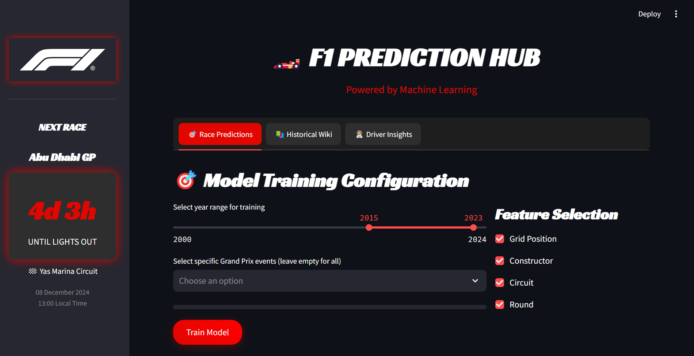

## ✨ Features

### 🎯 Race Predictions Engine
Our advanced machine learning model analyzes multiple factors to predict race outcomes:
- Grid position impact analysis
- Constructor performance metrics
- Track-specific predictions
- Weather condition considerations
- Tire strategy optimization

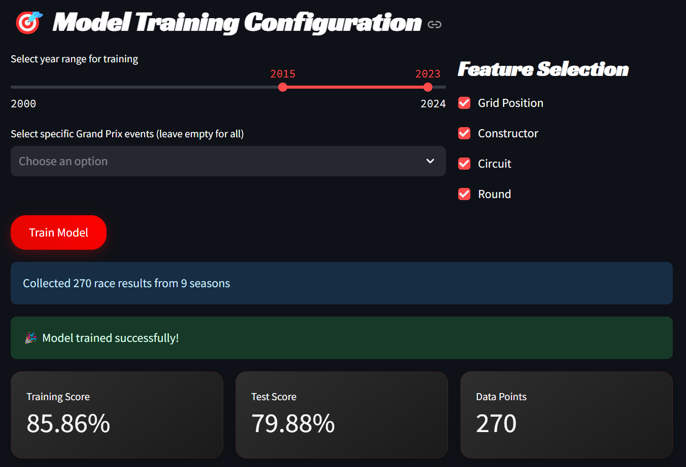
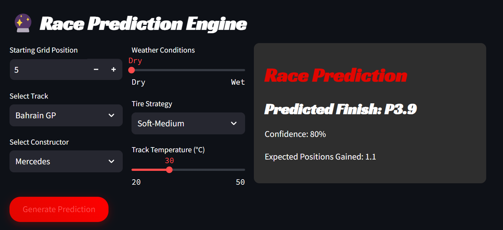

### 📊 Interactive Visualizations
- Position change predictions
- Historical performance heatmaps
- Real-time confidence metrics
- Feature importance analysis
- Performance trend tracking

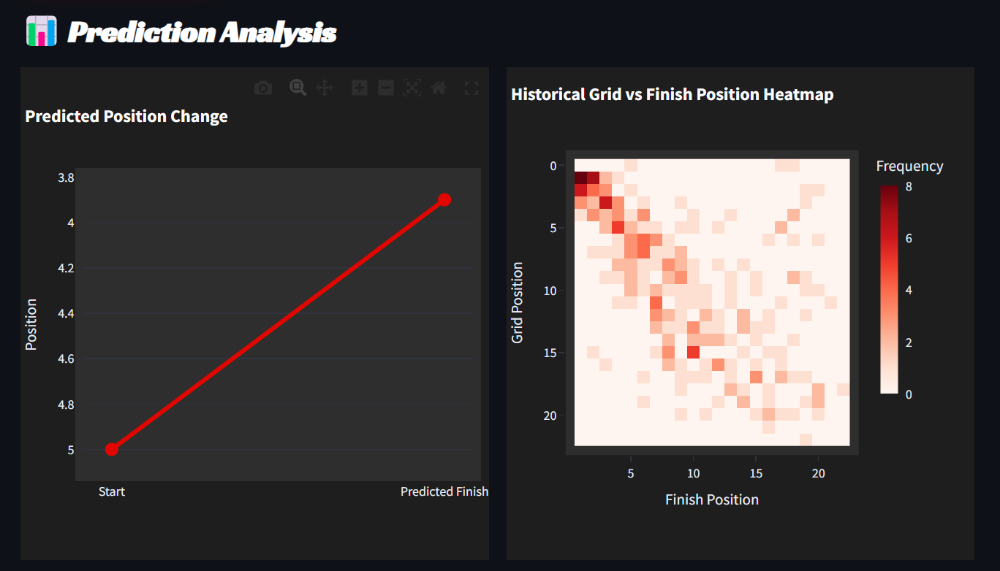

### 👨‍🚀 Driver Insights Hub
Comprehensive driver analytics including:
- Head-to-head comparisons
- Career statistics
- Driving style analysis
- Performance metrics tracking
- Historical achievements

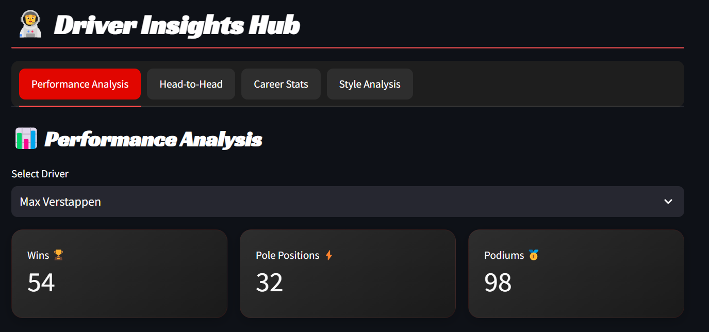
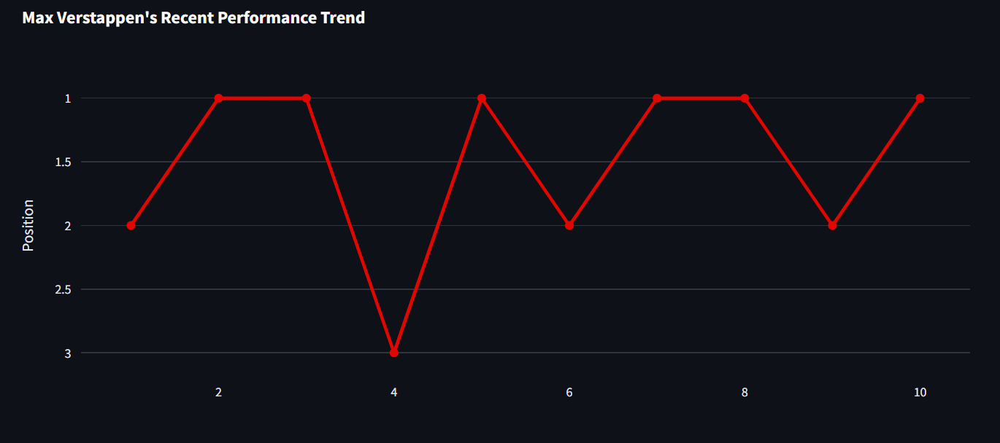
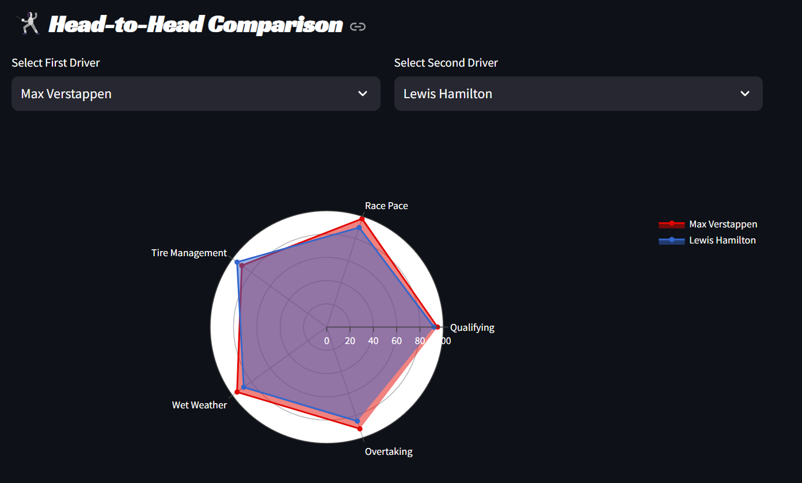
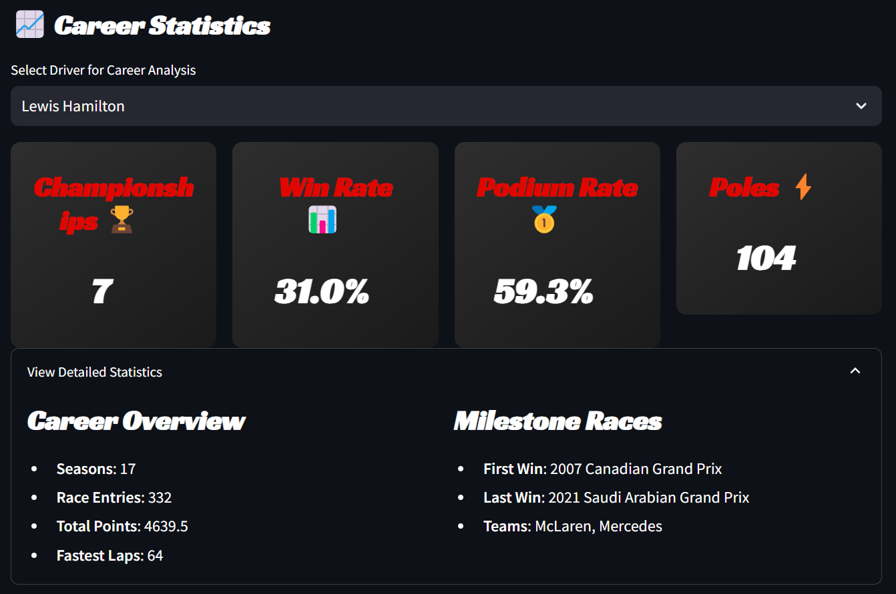
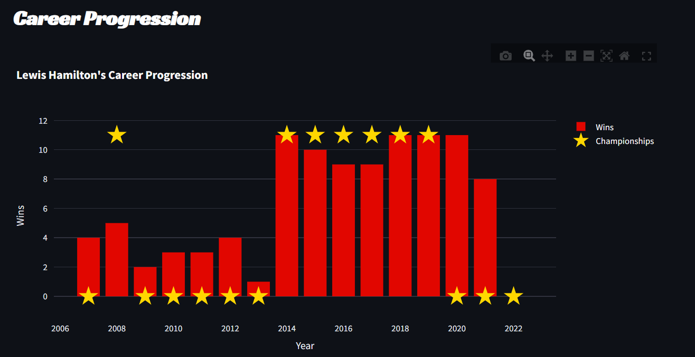

### 📚 Historical Encyclopedia
Explore F1's rich history through:
- Interactive timeline of significant events
- Championship records and statistics
- Iconic circuit information
- Technical evolution tracking
- Memorable moments archive

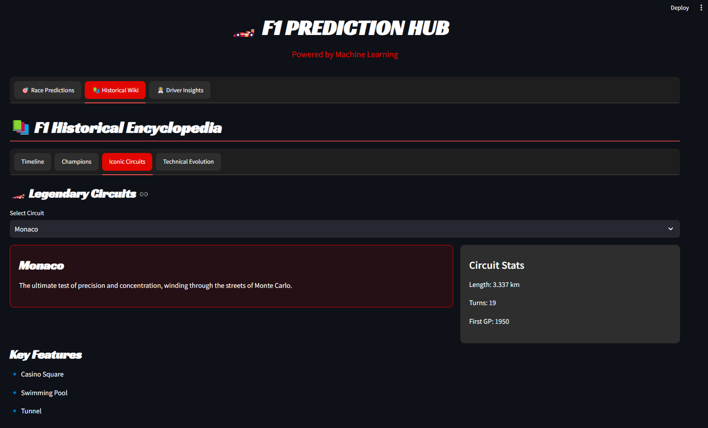
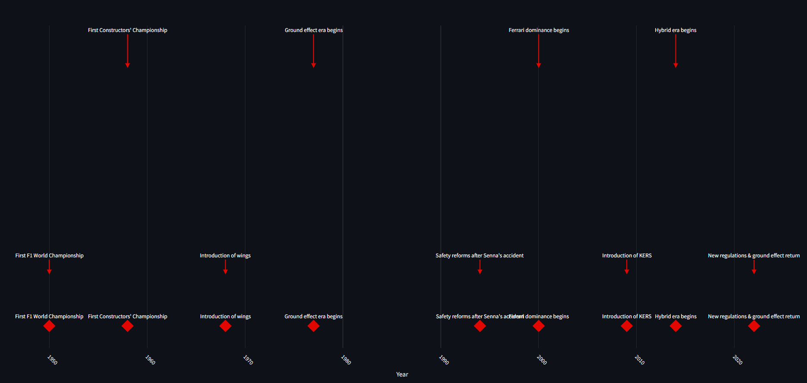
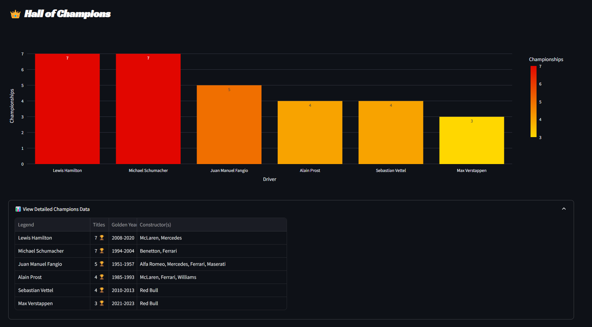
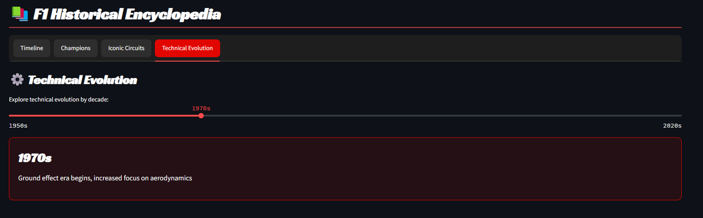

## 🚀 Getting Started

### Prerequisites
```bash
python 3.8+
pip
virtualenv (recommended)
```

### Installation

1. Clone the repository:
```bash
git clone https://github.com/yourusername/f1-prediction-hub.git
cd f1-prediction-hub
```

2. Create and activate virtual environment:
```bash
python -m venv venv
source venv/bin/activate  # On Windows: venv\Scripts\activate
```

3. Launch the dashboard:
```bash
streamlit run app.py
```

## 🌐 Hosting the Dashboard

### Local Hosting
The dashboard can be run locally using Streamlit:
```bash
streamlit run app.py
```
Access at `http://localhost:8501`

### Cloud Deployment

#### Streamlit Cloud
1. Push your code to GitHub
2. Visit [Streamlit Cloud](https://streamlit.io/cloud)
3. Connect your repository
4. Deploy with one click


#### Docker Deployment
1. Build the image:
```bash
docker build -t f1-prediction-hub .
```

2. Run the container:
```bash
docker run -p 8501:8501 f1-prediction-hub
```

## 🔧 Technical Architecture

### Components
- `app.py`: Main dashboard application
- `api_module.py`: F1 data retrieval and processing
- `ml_module.py`: Machine learning model implementation
- `driver_insights.py`: Driver analytics processing
- `historical_wiki.py`: Historical data management

### Data Sources
- Ergast F1 API
- Historical race data
- Driver statistics
- Circuit information

## 📈 Model Features

The prediction model considers:
- Grid position
- Constructor performance
- Circuit characteristics
- Weather conditions
- Track temperature
- Tire strategies
- Historical performance

## 🎨 UI Features

- Dark mode design
- Responsive layout
- Interactive charts
- Real-time updates
- Custom animations
- Mobile-friendly interface


## 📝 License

- This project is released under an open-source license. It is completely free for anyone to use, modify, and distribute. You are welcome to:

- Use the code for any purpose
- Study how it works and adapt it
- Redistribute it to anyone
- Make improvements and share them with everyone

## 🙏 Acknowledgments

- Formula 1 for the inspiration
- Ergast API for the data
- Streamlit team for the amazing framework
- The F1 community for their support


---
Made with ❤️ and ☕